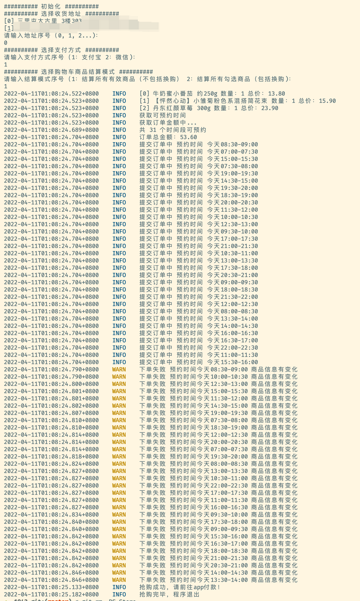

# 1942

> 最好开个叮咚的月卡哈！我只测试了会员。



Author: 无名氏
## Useage

1. 打开微信叮咚买菜，登录后，抓取接口请求，并在 mian.go 的 main 函数中修改如下配置

```golang
header := dd.CommonHeader{
    Cookie:    "DDXQSESSID=example",
    Uid:       "header中的 ddmc-uid",
    DeviceId:  "header中的 ddmc-device-id",

    // 这两个可以不配置
    Longitude: "",
    Latitude:  "",
}

// 这个是个手机通知，可以不配置，但你需要盯紧命令行
// 需要的话去app store下载一个
barkId := ""
```

2. 在叮咚 app 或小程序中把要采购的商品加购物车，由于访问量巨大，可能要点好几次才能加成功(叮咚现在每天两场抢购，早上 6:00，8:30，提前半小时爬起来加购物车)

3. 运行 main.go 测试一下是否可以选择地址

4. 配置 sleep 时间，开抢前 1 分钟运行本脚本

为了避免被风控，脚本内置的时间 sleep 比较长，推荐开抢前修改下面几个配置为。

WARNING: 该配置不适合在非抢购高峰期运行，若向长时间挂机捡漏，请将休眠时间调高！！！

```golang
var (
	cartSleepTime    = time.Millisecond * 100
	orderSleepTime   = time.Millisecond * 100
	reserveSleepTime = time.Millisecond * 100
)
```
